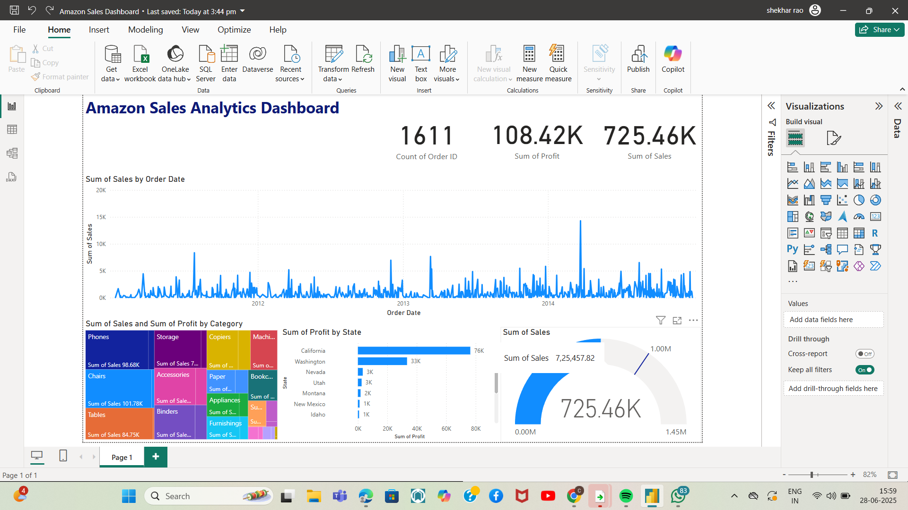

# 📈 Amazon Sales Dashboard - Power BI

## 📝 Project Overview:
This repository contains the **Amazon Sales Dashboard** created using **Power BI Desktop**.  
It helps visualize and analyze Amazon sales data, providing insights into key sales metrics, trends, and performance indicators.

---

## 📊 Dashboard Features:
- 📅 Sales Trend Analysis (Daily/Monthly/Yearly)
- 📦 Product Category-wise Sales Distribution
- 🌍 Regional Sales Performance
- 📈 Top Performing Products
- 🧾 Order Status Overview
- 💰 Revenue and Profit Tracking

---

## 📂 Repository Structure:
| File | Description |
|----|----|
| `Amazon Sales Dashboard.pbix` | Main Power BI report file |
| `Screenshots/` | dashboard preview images|
| `README.md` | Project description and instructions |

---

## 🚀 How to Use:

1. **Download** the `Amazon Sales Dashboard.pbix` file from this repository.
2. **Open** it using [Power BI Desktop](https://powerbi.microsoft.com/desktop/).
3. **Refresh the Data Source** if needed.
4. Explore the interactive visuals and gain insights.

---

## 📸 Dashboard Preview:

---

## 🛠️ Tools Used:
- Power BI Desktop
- Amazon Sales Dataset (Sample/Simulated)

---

## 🤝 Contribution:
Feel free to fork this repository, make improvements, and submit pull requests.

---

## 📌 License:
This project is for educational/demo purposes only.  
For commercial use, please contact the repository owner.

---

## ✉️ Contact:
For questions or collaboration opportunities, please contact:  
B Chandra Shekhar  
shekharrao150@gmail.com
GitHub:https://github.com/SHEKHARRAO)

